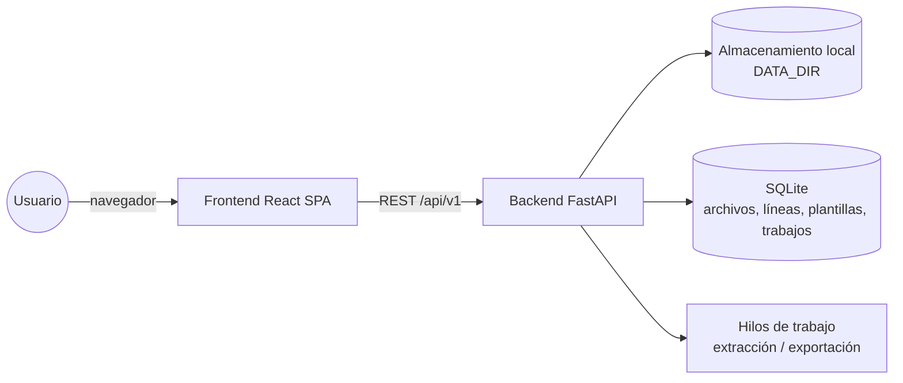
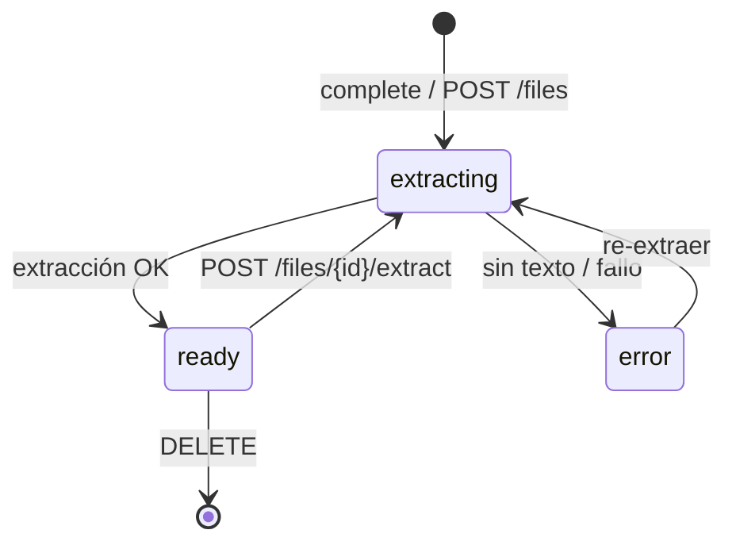
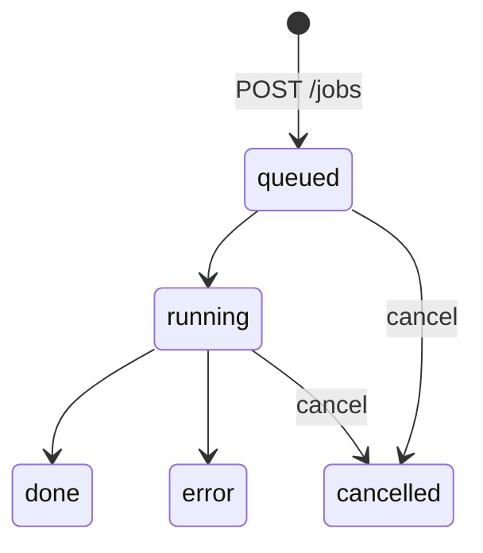

# Especificación de Requisitos de Software (SRS) — PDFMap

| Campo | Valor |
|---|---|
| Estándar | IEEE Std 830-1998 (Recommended Practice for Software Requirements Specifications) |
| Producto | PDFMap — Mapeador visual de reportes PDF/TXT a Excel |
| Versión del documento | 1.0 |
| Fecha | 2026-10-01 |
| Estado | Aprobado para línea base v0.1 |
| Responsable | Analista de requisitos (ver `.claude/agents/requirements-analyst.md`) |

## Historial de revisiones
| Versión | Fecha | Autor | Cambios |
|---|---|---|---|
| 0.1 | 2026-09-30 | Equipo JM | Borrador inicial: conversión de un formato de reporte fijo |
| 1.0 | 2026-10-01 | Equipo JM | Rediseño genérico: formato desconocido, mapeo visual, backend + frontend |

## Índice
1. [Introducción](#1-introducción)
2. [Descripción general](#2-descripción-general)
3. [Requisitos específicos](#3-requisitos-específicos)
4. [Apéndices](#4-apéndices)
5. [Índice alfabético](#5-índice-alfabético)

---

## 1. Introducción

### 1.1 Propósito
Este documento especifica los requisitos funcionales y no funcionales de **PDFMap**. Está dirigido a:
- desarrolladores backend (FastAPI/Python) y frontend (React/TypeScript);
- el equipo de QA, que deriva de aquí el [plan de pruebas](../04-testing/plan-de-pruebas-IEEE-829.md) y los [casos de prueba](../04-testing/casos-de-prueba.md);
- el responsable del producto, que valida el alcance y aprueba los cambios.

### 1.2 Alcance
PDFMap permite **cargar reportes PDF (con capa de texto) o TXT de formato desconocido**, visualizar su contenido como
una cuadrícula de texto de ancho fijo, **definir gráficamente** reglas de reconocimiento de líneas y campos, **diseñar
visualmente** las columnas del Excel resultante y procesar el archivo completo en segundo plano, generando **XLSX** y/o **CSV**.

Incluye: subida reanudable de archivos pesados, extracción y calibración automática, asistentes de regex y de columnas,
plantillas reutilizables, vista previa en vivo, validación de cuadre (totales impresos vs. calculados) y consulta paginada.

Fuera de alcance (v1.0): OCR de PDFs escaneados sin capa de texto, edición del PDF original, multiusuario con roles,
almacenamiento en la nube, entradas Excel/Word.

Beneficio: sustituir scripts ad‑hoc escritos para un único formato de reporte
por una herramienta reutilizable donde **el formato se configura, no se programa**.

### 1.3 Definiciones, acrónimos y abreviaturas
| Término | Definición |
|---|---|
| **Cuadrícula de texto** | Representación de cada página como líneas de texto de ancho fijo; cada carácter ocupa una columna calculada a partir de su posición X. |
| **Calibración** | Cálculo automático de `char_width` (ancho de carácter), `x_origin` (origen X) y `y_tolerance` (tolerancia vertical para agrupar líneas). |
| **Plantilla** | Documento JSON con reglas, columnas y opciones (ver [template-model.md](../architecture/template-model.md)). |
| **Regla** | Patrón que reconoce un tipo de línea y extrae campos; tiene una acción. |
| **Campo** | Valor extraído de una línea por rango de columnas, grupo regex o constante. |
| **Acción** | `row`, `context`, `row_context`, `append`, `check`, `skip`. |
| **Contexto** | Valores de líneas de encabezado que se heredan a las filas siguientes. |
| **Cuadre** | Comparación entre totales impresos en el reporte y la suma calculada de las filas. |
| **Trabajo (job)** | Proceso en segundo plano (extracción o exportación) con progreso persistente. |
| **Fragmento (chunk)** | Parte de un archivo subido por separado para permitir reanudar. |
| SRS | Software Requirements Specification. |
| RF / RNF | Requisito funcional / no funcional. |
| MoSCoW | Priorización Must / Should / Could / Won't. |
| API | Interfaz de programación (REST/JSON). |
| UUID | Identificador único universal (v4). |
| WCAG | Web Content Accessibility Guidelines. |

### 1.4 Referencias
- IEEE Std 830-1998 — *Recommended Practice for Software Requirements Specifications*.
- IEEE Std 829-2008 — *Standard for Software and System Test Documentation*.
- IEEE Std 1044-2009 — *Classification for Software Anomalies*.
- ISO/IEC 25010:2011 — Modelo de calidad del producto.
- OWASP API Security Top 10 (2023).
- WCAG 2.1 (W3C, 2018).
- [Contrato de la API](../architecture/api-contract.md) · [Modelo de plantilla](../architecture/template-model.md) · [Arquitectura](../03-diseno/arquitectura.md).

### 1.5 Visión general del documento
La sección 2 describe el producto en su contexto, usuarios y restricciones. La sección 3 detalla cada requisito con un
identificador estable, prioridad MoSCoW, fuente, entrada/proceso/salida y criterios de aceptación en formato
*Dado / Cuando / Entonces*, que se trazan a pruebas en la [RTM](../04-testing/matriz-trazabilidad-RTM.md).

---

## 2. Descripción general

### 2.1 Perspectiva del producto
PDFMap es un sistema autónomo compuesto por:

Incluye la plantilla precargada de ejemplo `builtin-ventas-ejemplo` ("Ventas por vendedor (ejemplo)"), que mapea el
reporte sintético generado por `generate_fixtures.py`. Todo el procesamiento es local (sin servicios externos).

### 2.2 Funciones del producto
1. Cargar archivos (simple o por fragmentos reanudables).
2. Extraer y calibrar la cuadrícula de texto; re‑extraer con parámetros manuales.
3. Navegar por páginas y buscar texto o regex.
4. Construir reglas desde una línea, con regex sugerida.
5. Definir campos arrastrando sobre el texto o aceptando columnas detectadas.
6. Configurar tipos y conversiones de campos.
7. Diseñar columnas del Excel por arrastrar y soltar.
8. Ver la vista previa y las anotaciones por línea en vivo.
9. Guardar, clonar, importar y exportar plantillas.
10. Procesar el archivo completo en segundo plano, con cancelación.
11. Descargar XLSX/CSV; consultar los resultados paginados; revisar errores y descuadres.
12. Eliminar archivos y sus datos.

### 2.3 Características de los usuarios
| Perfil | Descripción | Competencia técnica |
|---|---|---|
| **Analista contable / operativo** (principal) | Recibe reportes de sistemas heredados y necesita pasarlos a Excel. | Usuario avanzado de Excel; no programa. Puede usar regex sugeridas sin escribirlas. |
| **Usuario técnico / soporte** | Crea plantillas para formatos nuevos, ajusta regex y calibración. | Conoce expresiones regulares básicas. |
| **Integrador** | Automatiza el flujo vía API REST. | Desarrollador. |

### 2.4 Restricciones
- Backend en **Python ≥ 3.12** con FastAPI; frontend en **React + TypeScript + Vite**.
- Extracción de PDF mediante **pypdfium2**; Excel mediante **openpyxl** (modo `write_only`).
- Persistencia en **SQLite** (sin servidor de BD externo) y sistema de archivos local (`PDFMAP_DATA_DIR`).
- Las dependencias de Python se instalan **solo en un entorno virtual** (`.venv`), nunca globalmente.
- Los datos reales de clientes no pueden incluirse en el repositorio ni en los artefactos de CI.
- Interfaz en español.

### 2.5 Suposiciones y dependencias
- Los PDFs tienen **capa de texto** (generados por un sistema, no escaneados).
- Los reportes son mayormente tabulares con fuente monoespaciada o alineación por columnas; para fuentes proporcionales la cuadrícula es aproximada, pero se conservan todos los caracteres.
- El usuario usa un navegador moderno (Chrome, Edge, Firefox; últimas 2 versiones).
- El servidor dispone de disco suficiente: ~2× el tamaño del archivo más el tamaño de la salida.

---

## 3. Requisitos específicos

### 3.1 Interfaces externas

#### 3.1.1 Interfaces de usuario
- **IU-01 Zona de carga**: área de arrastrar y soltar más botón "Seleccionar archivo", con barra de progreso por fragmento y global, y opción de reanudar.
- **IU-02 Visor de cuadrícula**: texto monoespaciado con regla de columnas, numeración de líneas, paginación, color de fondo por regla coincidente y bandas de color para los campos.
- **IU-03 Panel de reglas**: lista ordenable de reglas, editor de match (tipo, valor, mayúsculas), acción, campos y botón "Crear regla desde línea".
- **IU-04 Diseñador de Excel**: lista de columnas arrastrable (dnd-kit), fuentes seleccionables, encabezado, ancho, formato y total.
- **IU-05 Vista previa**: tabla con las primeras N filas, estadísticas (aciertos por regla, no coincidentes, errores, cuadres).
- **IU-06 Trabajos**: progreso, cancelación, descarga y tabla paginada de resultados.
- Todos los componentes cumplen WCAG 2.1 AA (RNF-05).

#### 3.1.2 Interfaces de hardware
No se requieren interfaces de hardware específicas. Mínimo recomendado del servidor: 2 vCPU, 2 GB de RAM y disco ≥ 3× el archivo más grande.

#### 3.1.3 Interfaces de software
| Componente | Versión | Uso |
|---|---|---|
| Python | ≥ 3.12 | Backend |
| FastAPI / Uvicorn | 0.11x / 0.3x | API REST ASGI |
| pypdfium2 | ≥ 4 | Lectura de glifos y posiciones |
| openpyxl | 3.1 | Escritura XLSX streaming |
| SQLite | 3 (stdlib) | Persistencia |
| Node.js | ≥ 20 | Build del frontend |
| React | 18/19 | SPA |
| Docker | ≥ 24 | Despliegue opcional |

#### 3.1.4 Interfaces de comunicaciones
- HTTP/1.1 sobre TCP; HTTPS mediante proxy inverso en producción.
- API REST JSON versionada en `/api/v1` ([contrato](../architecture/api-contract.md)); OpenAPI en `/openapi.json`.
- Fragmentos binarios con `application/octet-stream`; descargas con `Content-Disposition: attachment`.
- CORS restringido a `PDFMAP_CORS_ORIGINS`.

### 3.2 Requisitos funcionales

Formato de cada requisito: **ID · Nombre** — Prioridad · Fuente · Descripción · Entrada · Proceso · Salida · Criterios de aceptación.

---

#### RF-01 · Carga de archivos PDF/TXT arrastrando o seleccionando
- **Prioridad**: Must · **Fuente**: Usuario principal (reemplazo de scripts de línea de comandos)
- **Descripción**: El sistema permitirá cargar archivos `.pdf`, `.txt`, `.prn` y `.lst` arrastrándolos a la zona de carga o seleccionándolos con el explorador de archivos.
- **Entrada**: uno o más archivos locales.
- **Proceso**: el frontend valida extensión y tamaño, decide subida simple (≤ tamaño de fragmento) o por fragmentos (RF-02) y muestra el progreso.
- **Salida**: registro `FileOut` con `status=extracting`; el archivo aparece en la lista.
- **Criterios de aceptación**:
  - *Dado* que estoy en la pantalla de carga, *cuando* arrastro un PDF válido a la zona, *entonces* se inicia la subida y veo una barra de progreso.
  - *Dado* que hago clic en "Seleccionar archivo", *cuando* elijo un `.txt`, *entonces* se sube y aparece en la lista de archivos.
  - *Dado* que arrastro un `.docx`, *cuando* lo suelto, *entonces* se rechaza con el mensaje "Tipo de archivo no soportado" sin enviarlo al servidor.

#### RF-02 · Subida por fragmentos reanudable para archivos pesados
- **Prioridad**: Must · **Fuente**: Requisito de "mapear archivos pesados"
- **Descripción**: Los archivos se suben en fragmentos de tamaño configurable (`PDFMAP_CHUNK_SIZE_MB`, por defecto 8 MB) hasta un máximo configurable (`PDFMAP_MAX_UPLOAD_MB`, por defecto 2048 MB = 2 GB). La subida puede reanudarse consultando los fragmentos ya recibidos.
- **Entrada**: `POST /uploads {filename,size}`; `PUT /uploads/{id}/chunks/{i}` (bytes); `POST /uploads/{id}/complete`.
- **Proceso**: el servidor reserva un identificador UUID, escribe cada fragmento en su posición (en cualquier orden), registra los índices recibidos y, al completar, verifica que todos estén presentes y que el tamaño coincida.
- **Salida**: `{upload_id, chunk_size, total_chunks}`, `{received,total_chunks}` y finalmente `FileOut`.
- **Criterios de aceptación**:
  - *Dado* un archivo de 100 MB, *cuando* se sube, *entonces* se envía en ⌈100/8⌉ = 13 fragmentos y el archivo final es idéntico byte a byte (SHA‑256).
  - *Dado* que la conexión se corta tras el fragmento 5, *cuando* reanudo, *entonces* `GET /uploads/{id}` devuelve `received=[0..5]` y solo se envían los fragmentos restantes.
  - *Dado* que llamo a `complete` con fragmentos faltantes, *entonces* recibo 409 con la lista de los faltantes.
  - *Dado* un índice de fragmento fuera de rango, *entonces* recibo 400.

#### RF-03 · Validación de tipo y tamaño
- **Prioridad**: Must · **Fuente**: Seguridad (RNF-03)
- **Descripción**: El servidor valida la extensión permitida, la firma mágica `%PDF-` en los PDF, la decodificabilidad del texto en TXT y el tamaño máximo.
- **Entrada**: nombre, tamaño declarado y contenido.
- **Proceso**: validación al iniciar la subida (extensión, tamaño) y al completarla (firma y tamaño real).
- **Salida**: aceptación o error 413 (tamaño) / 415 (tipo).
- **Criterios de aceptación**:
  - *Dado* un archivo `factura.pdf` cuyo contenido no empieza por `%PDF-`, *cuando* se completa la subida, *entonces* recibo 415 y el archivo se elimina.
  - *Dado* un tamaño declarado mayor que `MAX_UPLOAD_MB`, *cuando* inicio la subida, *entonces* recibo 413.
  - *Dado* un nombre `../../etc/passwd.pdf`, *entonces* el nombre almacenado se sanitiza y no se escribe fuera de `DATA_DIR`.

#### RF-04 · Extracción automática a cuadrícula de texto, con calibración y re‑extracción manual
- **Prioridad**: Must · **Fuente**: Rediseño genérico (formato desconocido)
- **Descripción**: Tras la carga, el sistema extrae en segundo plano el texto de cada página como líneas de ancho fijo. Calibra automáticamente `char_width` (mediana del ancho de glifo), `x_origin` (X mínima) y `y_tolerance` (30 % de la altura mediana) con las 5 primeras páginas. El usuario puede re‑extraer con parámetros manuales.
- **Entrada**: archivo cargado; opcionalmente `{char_width, x_origin, y_tolerance}`.
- **Proceso**: lectura de glifos con pypdfium2, agrupamiento por Y, colocación por X sin pérdida de caracteres (colisiones se desplazan a la derecha) y almacenamiento de las líneas en SQLite por lotes, con progreso.
- **Salida**: `FileOut` con `status=ready`, `pages`, `lines` y `extraction`.
- **Criterios de aceptación**:
  - *Dado* el PDF de referencia monoespaciado (Courier 7 pt), *cuando* termina la extracción, *entonces* `char_width ≈ 4.2` y las columnas de la línea de detalle coinciden con el reporte.
  - *Dado* un PDF sin capa de texto, *entonces* `status=error` con el mensaje "El PDF no contiene texto extraíble (¿escaneado?)".
  - *Dado* que re‑extraigo con `char_width=5`, *entonces* las líneas se regeneran y el `FileOut.extraction.char_width` es 5.
  - *Dado* un TXT con saltos de página `\f`, *entonces* cada `\f` inicia una página nueva.

#### RF-05 · Visualización paginada de líneas
- **Prioridad**: Must · **Fuente**: Mapeo visual
- **Descripción**: Se muestran las líneas de una página con su número, en fuente monoespaciada, con regla de columnas y navegación (anterior, siguiente, ir a la página N).
- **Entrada**: `GET /files/{id}/pages/{page}`.
- **Salida**: `{page, pages, lines:[{n,text}]}`.
- **Criterios de aceptación**:
  - *Dado* un archivo listo de 2000 páginas (PDF sintético de referencia generado con `generate_fixtures.py`), *cuando* voy a la página 2000, *entonces* veo sus líneas en < 500 ms.
  - *Dado* la página 0 o 2001, *entonces* la API responde 404.

#### RF-06 · Búsqueda de texto / regex
- **Prioridad**: Should · **Fuente**: Mapeo visual
- **Descripción**: Buscar líneas en todo el archivo por texto literal o expresión regular, con límite de resultados.
- **Entrada**: `pattern`, `mode=regex|contains`, `limit` (≤ 500).
- **Salida**: `{matches:[{page,n,text}], truncated}`.
- **Criterios de aceptación**:
  - *Dado* el patrón `Total vendedor:`, *entonces* obtengo las líneas que lo contienen con su página.
  - *Dado* una regex inválida `([`, *entonces* recibo 400 "Expresión regular inválida".
  - *Dado* una regex de más de 500 caracteres, *entonces* recibo 422.

#### RF-07 · Crear regla desde la línea seleccionada con regex sugerida
- **Prioridad**: Must · **Fuente**: Mapeo visual
- **Descripción**: Al seleccionar una línea, el usuario pulsa "Crear regla" y el sistema propone una regex basada en la *forma* de los primeros tokens (letras → `[A-Z]{n}`, dígitos → `\d{n}`, etiquetas literales). El usuario puede ajustar cuántos tokens usar y ver cuántas líneas coinciden.
- **Entrada**: `POST /mapping/suggest-regex {line, tokens}`.
- **Salida**: `{regex}` y una regla nueva con color asignado.
- **Criterios de aceptación**:
  - *Dado* la línea `01/02/2026  F-000123  COMERCIAL ANDES S.A. …`, *cuando* pido sugerencia con 2 tokens, *entonces* obtengo `^\d{2}/\d{2}/\d{4}\s+F-\d{6}` o equivalente que coincide con todas las líneas de venta.
  - *Dado* la línea `      Total vendedor:   12   10.00`, *entonces* la regex empieza con `^\s*Total vendedor:` (o equivalente literal).
  - *Dado* que creo la regla, *entonces* las líneas coincidentes de la página se resaltan con el color de la regla.

#### RF-08 · Definir campos arrastrando sobre el texto y detección automática de columnas y tipos
- **Prioridad**: Must · **Fuente**: Mapeo visual
- **Descripción**: Sobre una línea de la regla activa, el usuario arrastra el ratón entre columnas para crear un campo `{start,end}`; puede redimensionarlo y moverlo. "Detectar columnas" analiza las líneas coincidentes y propone segmentos separados por columnas en blanco en todas ellas, con tipo inferido. También se admiten campos por grupo regex y constantes.
- **Entrada**: selección de rango; `POST /mapping/suggest-columns {lines, min_gap}`.
- **Salida**: campos de la regla; `{segments:[{start,end,type,...}]}` (el último con `end=null`).
- **Criterios de aceptación**:
  - *Dado* que arrastro desde la columna 41 hasta la 54, *entonces* se crea un campo con `start=41,end=54` mostrado como una banda de color.
  - *Dado* líneas de detalle con montos `1,234.56`, *cuando* detecto columnas, *entonces* el segmento correspondiente tiene `type=number, decimal="."`.
  - *Dado* fechas `01/02/2026` en todas las líneas, *entonces* el tipo inferido es `date` con un formato válido para todas.

#### RF-09 · Tipos y conversión
- **Prioridad**: Must · **Fuente**: Exactitud de datos
- **Descripción**: Cada campo tiene tipo `text`, `number`, `integer` o `date`. Los números admiten separador decimal `.` o `,`, separadores de miles, símbolos de moneda, negativos con `-` inicial o final y paréntesis. Las fechas usan formatos `strftime` explícitos o detección automática. Se admiten `null_values`, `default` y `required`.
- **Proceso**: conversión con `Decimal` (sin pérdida de precisión); un error de conversión se registra y el valor queda nulo (no aborta).
- **Criterios de aceptación**:
  - `"1.234,56"` con `decimal=","` → `1234.56`; `"(100.00)"` → `-100.00`; `"50.00-"` → `-50.00`; `".00"` → `0`; `"-"` → nulo.
  - `"21/01/01"` con `%y/%m/%d` → 2021‑01‑01.
  - `"abc"` como número → error registrado en `stats.errors` con página y línea; la fila se genera con el valor nulo.
  - Campo con `null_values:["N/D"]` → nulo.
  - Campo `required` vacío → la regla no coincide con esa línea.

#### RF-10 · Acciones de regla
- **Prioridad**: Must · **Fuente**: Reportes jerárquicos (vendedor → venta → notas)
- **Descripción**: Cada regla tiene una acción: `row` (emite fila), `context` (guarda valores para filas siguientes), `row_context` (ambas), `append` (concatena texto a la fila anterior), `check` (control de cuadre, RF-16) y `skip` (ignora). `clears` borra contextos. Las reglas se evalúan en orden y gana la primera.
- **Criterios de aceptación**:
  - *Dado* una línea de vendedor (`context`) seguida de dos ventas (`row`), *entonces* ambas filas contienen el código de vendedor.
  - *Dado* una regla `append` para líneas de continuación de descripción, *entonces* el texto se concatena con un espacio al campo destino de la fila anterior.
  - *Dado* una regla `row_context` "factura" y un nuevo vendedor con `clears:["factura"]`, *entonces* las filas siguientes no heredan la factura anterior.
  - *Dado* dos reglas que coinciden con la misma línea, *entonces* se aplica solo la primera en el orden.

#### RF-11 · Diseño visual de columnas del Excel
- **Prioridad**: Must · **Fuente**: "armar el Excel visualmente"
- **Descripción**: El usuario agrega columnas, las reordena arrastrando, cambia el encabezado, elige una o varias fuentes (`regla.campo` o `@page`, `@line`, `@rule`, `@raw`), ancho, formato numérico, total y activación.
- **Criterios de aceptación**:
  - *Dado* que arrastro la columna "Total" a la primera posición, *entonces* la vista previa y el Excel muestran "Total" como columna A.
  - *Dado* una columna con fuentes `[venta.factura, devolucion.factura]`, *entonces* cada fila toma el valor de su propia regla (o el primer valor del contexto).
  - *Dado* una columna con `total=true`, *entonces* el Excel tiene una fila TOTAL con `SUBTOTAL(9,…)`.
  - Es operable con teclado (RNF-05).

#### RF-12 · Vista previa en vivo
- **Prioridad**: Must · **Fuente**: Usabilidad
- **Descripción**: Cada cambio en la plantilla actualiza (con debounce ≤ 500 ms) la anotación de la página actual y la vista previa de las primeras `max_pages` (por defecto 20) páginas, limitada a `limit` filas.
- **Criterios de aceptación**:
  - *Dado* que cambio el tipo de un campo a `number`, *entonces* en ≤ 2 s la vista previa muestra los valores convertidos o los errores.
  - La vista previa muestra `rule_hits`, `unmatched`, `error_count` y los descuadres.
  - Una plantilla inválida muestra los errores de validación sin romper la UI.

#### RF-13 · Gestión de plantillas
- **Prioridad**: Must · **Fuente**: Reutilización por formato
- **Descripción**: CRUD de plantillas; clonar; importar y exportar JSON; plantilla precargada de ejemplo de solo lectura `builtin-ventas-ejemplo` ("Ventas por vendedor (ejemplo)").
- **Criterios de aceptación**:
  - *Dado* una plantilla nueva válida, *cuando* la guardo, *entonces* aparece en `GET /templates` con `updated_at`.
  - *Dado* la plantilla precargada, *cuando* intento `PUT`, *entonces* recibo 403; *cuando* la clono, *entonces* obtengo una copia editable.
  - *Dado* un JSON exportado, *cuando* lo importo, *entonces* la plantilla resultante es equivalente (mismas reglas y columnas).
  - *Dado* un JSON con una regex inválida o una fuente inexistente, *entonces* la importación se rechaza con 422 y un detalle por error.

#### RF-14 · Procesamiento en segundo plano con progreso y cancelación
- **Prioridad**: Must · **Fuente**: Archivos pesados
- **Descripción**: `POST /jobs` encola un trabajo de exportación ejecutado por un pool de hilos (`PDFMAP_WORKERS`). El estado (`queued`, `running`, `done`, `error`, `cancelled`) y el progreso se persisten; se puede cancelar.
- **Criterios de aceptación**:
  - *Dado* un trabajo en ejecución, *cuando* consulto `GET /jobs/{id}`, *entonces* `progress` aumenta monótonamente entre 0 y 1.
  - *Dado* que cancelo, *entonces* el estado pasa a `cancelled` en ≤ 2 s y no queda un archivo de salida parcial disponible.
  - *Dado* que reinicio el servidor, *entonces* los trabajos `done` siguen consultables y los que quedaron `running` se marcan `error` ("interrumpido").

#### RF-15 · Exportación XLSX streaming y CSV
- **Prioridad**: Must · **Fuente**: Salida Excel
- **Descripción**: Se genera XLSX con openpyxl `write_only` (memoria constante), encabezado con estilo, panel congelado, autofiltro, formatos por tipo y fila de totales. Si se superan 1.048.576 filas se crean hojas adicionales `Datos (2)`, … El CSV es UTF‑8 con BOM y delimitador configurable (por defecto `;`).
- **Criterios de aceptación**:
  - *Dado* 60.000 filas, *entonces* el XLSX tiene 60.000 filas de datos más el encabezado y la fila TOTAL.
  - *Dado* un límite de prueba de 100 filas por hoja y 250 filas, *entonces* hay 3 hojas.
  - *Dado* fechas y números, *entonces* en Excel son celdas de tipo fecha/número (no texto).
  - `GET /jobs/{id}/download?format=csv` devuelve el CSV con `Content-Disposition`.

#### RF-16 · Validación de cuadre y reporte de errores
- **Prioridad**: Should · **Fuente**: Exactitud de datos (controles impresos en el reporte)
- **Descripción**: Las reglas `check` comparan valores impresos (totales) con la suma de columnas desde el último reinicio del grupo, con tolerancia configurable. Las estadísticas incluyen errores de conversión y descuadres (página, línea, regla, mensaje), con hasta 500 detalles y conteos totales.
- **Criterios de aceptación**:
  - *Dado* el reporte sintético de `generate_fixtures.py` con la plantilla de ejemplo, *entonces* `checks_ok` es igual al número de vendedores y `checks_failed_count = 0`.
  - *Dado* un total impreso alterado, *entonces* aparece en `checks_failed` con "impreso X vs calculado Y".
  - Más de 500 errores → `error_count` refleja el total y `errors` contiene 500 elementos.

#### RF-17 · Consulta paginada de resultados
- **Prioridad**: Should · **Fuente**: Archivos pesados
- **Descripción**: `GET /jobs/{id}/rows?offset&limit` devuelve filas ya procesadas, con `total`, sin cargar todo en memoria; el frontend usa tabla paginada/virtualizada.
- **Criterios de aceptación**:
  - `limit` máximo 1000; `offset` mayor que el total → lista vacía.
  - La fila `offset=n` coincide con la fila `n+2` del XLSX (tras el encabezado).

#### RF-18 · Eliminación de archivos y datos asociados
- **Prioridad**: Must · **Fuente**: Privacidad (RNF-09)
- **Descripción**: `DELETE /files/{id}` elimina el archivo original, sus líneas, trabajos, filas y salidas.
- **Criterios de aceptación**:
  - Tras eliminar, `GET /files/{id}` → 404 y no quedan archivos en `DATA_DIR/files/{id}` ni salidas de sus trabajos.
  - Eliminar un archivo con un trabajo en curso cancela el trabajo primero.

### 3.3 Requisitos de rendimiento

#### RNF-01 · Rendimiento
- **Prioridad**: Must
- Extracción ≥ **40 páginas/s** en el PDF sintético de referencia generado con `generate_fixtures.py --pages 2000`.
- Vista previa de 20 páginas en **< 2 s**; página individual en < 500 ms (p95).
- **Verificación**: `backend/tests/performance/` (marcador `slow`/`perf`) y `locustfile.py`.

#### RNF-02 · Escalabilidad y memoria constante
- **Prioridad**: Must
- Subida, extracción, mapeo y exportación en streaming: el uso de memoria no crece con el número de filas (objetivo < 300 MB RSS procesando 1 GB).
- Archivos ≥ **1 GB** soportados (límite configurable por defecto 2 GB).
- **Verificación**: prueba de rendimiento con PDF sintético generado (`generate_fixtures.py --pages 20000`).

### 3.4 Restricciones de diseño
- Arquitectura en capas: `core` (puro, sin E/S de red) → `services` (persistencia, trabajos) → `api` (FastAPI). Ver [ADRs](../03-diseno/adr/).
- El motor de mapeo trabaja con diccionarios validados por Pydantic en la capa API.
- Estándares: PEP 8 (ruff), tipado estático (mypy, TypeScript `strict`), Conventional Commits, SemVer.

### 3.5 Atributos del sistema de software

#### RNF-03 · Seguridad
- **Prioridad**: Must
- API key opcional (`X-API-Key`, comparación en tiempo constante); validación de entrada con Pydantic; sanitización de nombres de archivo; identificadores UUID v4 (sin rutas de usuario); límite de 500 caracteres por regex y límite de búsqueda; resolución de rutas confinada a `DATA_DIR` (sin path traversal); CORS restringido; límites de tamaño; cabeceras de seguridad; sin ejecución de código del usuario.
- Cobertura del OWASP API Top 10: API1 (BOLA: IDs no adivinables), API2 (autenticación por clave), API3 (respuestas con esquemas), API4 (límites de tamaño, `limit`, regex), API8 (configuración segura y CORS), API9 (inventario: OpenAPI versionado).
- **Verificación**: `backend/tests/security/`, Bandit, CodeQL, pip-audit, npm audit y gitleaks en CI.

#### RNF-04 · Usabilidad
- **Prioridad**: Should
- Interfaz en español, arrastrar y soltar, retroalimentación visual inmediata (colores por regla, bandas de campos, progreso, toasts de error), flujo guiado en pasos: *Cargar → Mapear → Diseñar Excel → Procesar*.
- Un usuario nuevo crea una plantilla para un formato sencillo en ≤ 15 minutos con el [manual](../05-operacion/manual-usuario.md).

#### RNF-05 · Accesibilidad
- **Prioridad**: Should
- WCAG 2.1 AA: contraste ≥ 4.5:1, foco visible, navegación por teclado (incluido el arrastre de columnas con dnd-kit `KeyboardSensor`), etiquetas ARIA y anuncios en vivo del progreso.
- **Verificación**: `frontend/tests/a11y` (axe) y Playwright con `@axe-core/playwright`.

#### RNF-06 · Mantenibilidad
- **Prioridad**: Must
- Cobertura de pruebas: backend ≥ **80 %**, frontend ≥ **70 %** (umbral de fallo en CI); ruff y mypy sin errores; ESLint y `tsc --noEmit` sin errores; documentación sincronizada.

#### RNF-07 · Portabilidad
- **Prioridad**: Should
- Funciona en Windows 10/11 y Linux; imagen Docker y `docker compose`; rutas con `pathlib`.

#### RNF-08 · Confiabilidad
- **Prioridad**: Must
- Estado de archivos y trabajos persistente en SQLite (WAL); aritmética `Decimal`; un error en una línea no aborta el proceso; las escrituras de salida son atómicas (archivo temporal más renombrado); trabajos interrumpidos se marcan al reiniciar.
- **Disponibilidad**: servicio local; `GET /health` para sondas de disponibilidad.

#### RNF-09 · Privacidad
- **Prioridad**: Must
- Todo el procesamiento es local; no hay telemetría ni servicios externos; los datos reales de clientes quedan fuera del repositorio (`.gitignore`) y de CI; las pruebas usan datos sintéticos; RF-18 permite el borrado total.

---

## 4. Apéndices

### Apéndice A — Resumen y priorización
| ID | Nombre | MoSCoW | Hito |
|---|---|---|---|
| RF-01 | Carga arrastrando/seleccionando | Must | v0.1 |
| RF-02 | Subida por fragmentos reanudable | Must | v0.1 |
| RF-03 | Validación de tipo y tamaño | Must | v0.1 |
| RF-04 | Extracción y calibración | Must | v0.1 |
| RF-05 | Visualización paginada | Must | v0.1 |
| RF-06 | Búsqueda texto/regex | Should | v0.2 |
| RF-07 | Regla desde línea | Must | v0.2 |
| RF-08 | Campos arrastrando + detección | Must | v0.2 |
| RF-09 | Tipos y conversión | Must | v0.2 |
| RF-10 | Acciones de regla | Must | v0.2 |
| RF-11 | Diseño visual de columnas | Must | v0.3 |
| RF-12 | Vista previa en vivo | Must | v0.3 |
| RF-13 | Plantillas | Must | v0.3 |
| RF-14 | Trabajos en segundo plano | Must | v0.1 |
| RF-15 | Exportación XLSX/CSV | Must | v0.3 |
| RF-16 | Cuadre y errores | Should | v0.3 |
| RF-17 | Resultados paginados | Should | v1.0 |
| RF-18 | Eliminación | Must | v1.0 |
| RNF-01…09 | No funcionales | — | Transversal, verificados en v1.0 |

### Apéndice B — Estados

### Apéndice C — Trazabilidad
Ver la [matriz de trazabilidad (RTM)](../04-testing/matriz-trazabilidad-RTM.md).

---

## 5. Índice alfabético
- Acciones de regla — RF-10
- Accesibilidad — RNF-05
- Búsqueda — RF-06
- Calibración — RF-04
- Columnas Excel — RF-11
- Cuadre — RF-16
- CSV — RF-15
- Eliminación — RF-18
- Fragmentos (chunks) — RF-02
- Plantillas — RF-13
- Privacidad — RNF-09
- Regex sugerida — RF-07
- Rendimiento — RNF-01
- Seguridad — RNF-03
- Tipos de dato — RF-09
- Trabajos — RF-14
- Vista previa — RF-12
