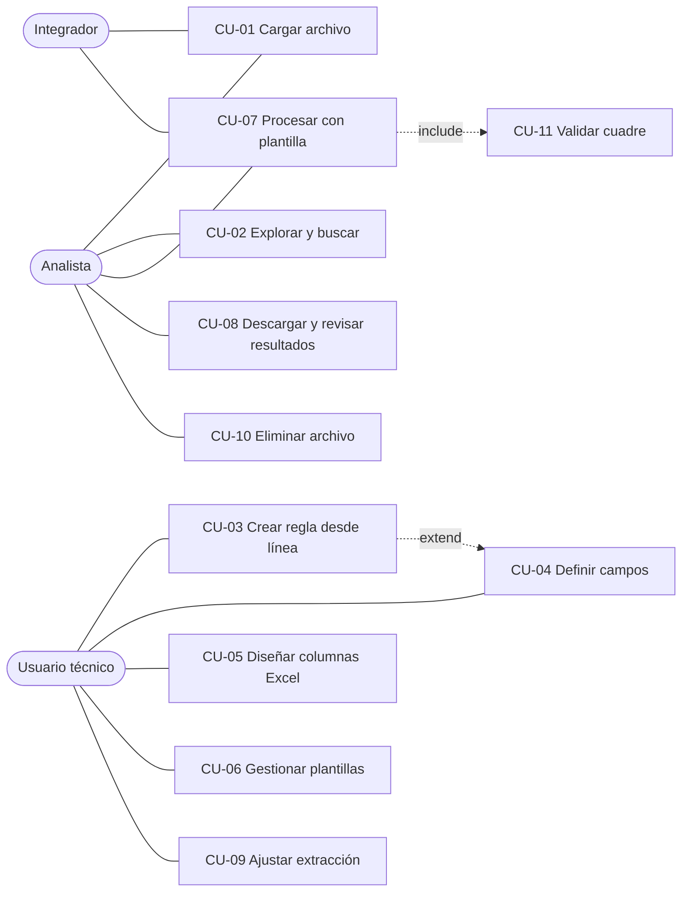

# Casos de uso

## Actores
| Actor | Tipo | Descripción |
|---|---|---|
| Analista | Primario | Carga reportes, usa plantillas existentes y descarga el Excel. |
| Usuario técnico | Primario | Diseña plantillas para formatos nuevos. |
| Integrador | Primario (sistema) | Consume la API REST para automatizar. |
| Planificador de trabajos | Secundario (interno) | Pool de hilos que ejecuta la extracción y la exportación. |

## Diagrama

---

### CU-01 Cargar archivo (RF-01, RF-02, RF-03, RF-04)
- **Actor**: Analista / Integrador
- **Precondición**: el backend está disponible.
- **Flujo principal**:
  1. El usuario arrastra un PDF a la zona de carga (o lo selecciona).
  2. El sistema valida la extensión y el tamaño en el cliente.
  3. El sistema inicia la subida (`POST /uploads`) y envía los fragmentos mostrando el progreso.
  4. El sistema completa la subida, valida la firma `%PDF-` y crea el registro de archivo.
  5. El sistema extrae en segundo plano y muestra el progreso de extracción.
  6. El archivo queda en estado `ready` con el número de páginas y líneas.
- **Flujos alternativos**:
  - 2a. Tipo no soportado → mensaje de error; fin.
  - 3a. Fallo de red → reintento automático (3 veces con backoff); si persiste, botón "Reanudar" que consulta `GET /uploads/{id}` y envía los faltantes.
  - 4a. Firma inválida → 415; el sistema elimina el temporal.
  - 5a. PDF sin texto → estado `error` con explicación (ver runbook).
- **Postcondición**: líneas disponibles para el mapeo.

### CU-02 Explorar y buscar (RF-05, RF-06)
1. El usuario abre un archivo listo; el sistema muestra la página 1 con la regla de columnas.
2. El usuario navega por las páginas o escribe una búsqueda (texto/regex).
3. El sistema lista las coincidencias con su página; al hacer clic salta a la línea.
- **Alternativo**: regex inválida → mensaje en línea, sin petición.

### CU-03 Crear regla desde línea (RF-07, RF-10)
1. El usuario hace clic en una línea representativa (p. ej. una factura).
2. Pulsa "Crear regla desde línea".
3. El sistema sugiere una regex, asigna un color, crea la regla con acción `row` y resalta las coincidencias.
4. El usuario ajusta los tokens, la acción (context, check…), el nombre y `clears`.
- **Alternativo**: la regex coincide con líneas no deseadas → el usuario añade un token más o marca un campo como `required`.

### CU-04 Definir campos (RF-08, RF-09)
1. Con una regla activa, el usuario arrastra sobre el texto de una línea coincidente desde la columna inicial a la final.
2. El sistema crea el campo, infiere el tipo y muestra la banda de color.
3. El usuario renombra el campo y ajusta el tipo, los formatos de fecha, el separador decimal, los nulos, el defecto y `required`.
- **Alternativo**: "Detectar columnas" → el sistema propone todos los segmentos y el usuario acepta o descarta.
- **Alternativo**: campos por grupo regex (`(?P<nombre>…)`) o constantes.

### CU-05 Diseñar columnas Excel (RF-11, RF-12)
1. El usuario agrega columnas desde los campos disponibles (o "Agregar todos").
2. Reordena arrastrando, cambia encabezados y combina fuentes.
3. El sistema actualiza la vista previa en vivo.

### CU-06 Gestionar plantillas (RF-13)
Guardar, cargar, clonar (obligatorio para modificar la precargada), importar o exportar JSON y eliminar.

### CU-07 Procesar con plantilla (RF-14, RF-15)
1. El usuario elige formatos (XLSX/CSV) y pulsa "Procesar".
2. El sistema crea el trabajo, muestra el progreso y permite cancelar.
3. Al terminar, muestra las estadísticas y los botones de descarga.

### CU-08 Descargar y revisar resultados (RF-15, RF-16, RF-17)
El usuario descarga los archivos, revisa la tabla paginada y la lista de errores y descuadres con un enlace a la página/línea.

### CU-09 Ajustar extracción (RF-04)
Si las columnas aparecen desalineadas, el usuario abre "Parámetros de extracción", modifica `char_width`, `x_origin` o `y_tolerance` y re‑extrae.

### CU-10 Eliminar archivo (RF-18)
El usuario confirma la eliminación; el sistema cancela los trabajos activos y borra el archivo, las líneas, las filas y las salidas.

### CU-11 Validar cuadre (RF-16)
Incluido en CU-07: por cada línea `check`, el sistema compara los totales impresos con las sumas acumuladas y registra las diferencias.
