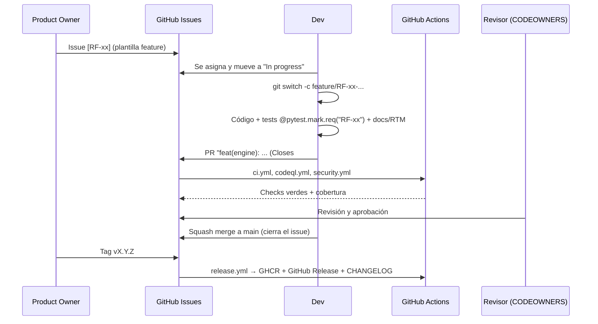

# Gestión de configuración

## Estrategia de ramas (trunk-based con ramas cortas)
- `main`: siempre desplegable y protegida.
- Ramas de trabajo de vida corta (≤ 3 días), creadas desde `main`:

| Prefijo | Uso | Ejemplo |
|---|---|---|
| `feature/` | Nueva funcionalidad | `feature/RF-08-drag-fields` |
| `fix/` | Corrección de defecto | `fix/DEF-012-decimal-comma` |
| `test/` | Solo pruebas | `test/RF-15-multisheet` |
| `docs/` | Documentación | `docs/srs-rf-16` |
| `chore/` | Mantenimiento, dependencias | `chore/bump-fastapi` |
| `hotfix/` | Corrección urgente sobre un release | `hotfix/1.0.1-upload` |

## Conventional Commits
```
<tipo>(<ámbito>): <descripción en imperativo>

[cuerpo]

Refs: RF-08, #23
```
Tipos: `feat`, `fix`, `test`, `docs`, `refactor`, `perf`, `ci`, `build`, `chore`, `style`. Un `!` o `BREAKING CHANGE:` indica un cambio mayor.
Ámbitos: `backend`, `frontend`, `engine`, `api`, `ui`, `docs`, `ci`.

## Versionado semántico (SemVer)
`MAJOR.MINOR.PATCH` — MAJOR: cambio incompatible de la API/plantilla; MINOR: funcionalidad compatible; PATCH: correcciones.
El `version` del modelo de plantilla se incrementa si cambia su esquema. Los releases se etiquetan `vX.Y.Z` y disparan `release.yml`.

## Protección de `main`
- PR obligatorio con ≥ 1 aprobación de CODEOWNERS.
- Checks requeridos: `backend`, `frontend`, `e2e`, `docker`, `CodeQL`, `security`.
- Rama actualizada antes de fusionar; historial lineal (squash merge).
- Sin push forzado ni borrado; conversaciones resueltas.

## Flujo completo



## Elementos de configuración controlados
Código (`backend/`, `frontend/`), plantillas precargadas (`backend/app/templates_builtin/`), documentación (`docs/`),
workflows (`.github/`), dependencias bloqueadas (`requirements*.txt`, `package-lock.json`), imágenes Docker.

**Excluidos** (nunca se versionan): datos reales de clientes (`*.Pdf`/`*.pdf`/`*.xlsx` en la raíz), `data/`, `.env` y `.venv/`.
