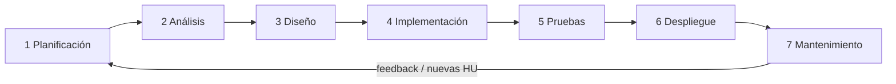
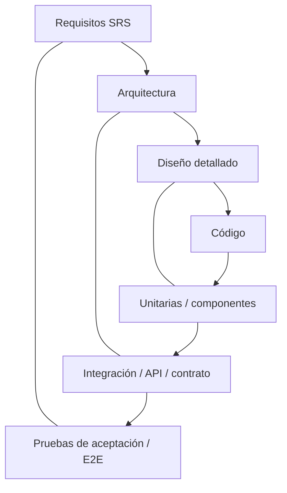

# Modelo SDLC de PDFMap

## Modelo elegido: iterativo‑incremental (Scrum‑lite)

El producto nació como un script de propósito único para un formato fijo y evolucionó a una herramienta genérica. Los
requisitos de UX (mapeo visual) se descubren mejor iterando con el usuario, por lo que se usa un modelo
**iterativo‑incremental** con sprints de 2 semanas, ceremonias ligeras y gates de calidad automatizados en CI.
El **STLC** ([04-testing/stlc.md](../04-testing/stlc.md)) se ejecuta en paralelo dentro de cada iteración (modelo en V por incremento).

### Modelo en V por incremento

## Fases, entregables y gates

| # | Fase | Actividades | Entregables (artefacto en el repo) | Gate de salida |
|---|---|---|---|---|
| 1 | **Planificación** | Visión, alcance, hitos, riesgos, estimación | [plan-proyecto.md](plan-proyecto.md), milestones de GitHub | Hitos y riesgos aprobados |
| 2 | **Análisis** | Elicitación, SRS, casos de uso, historias, criterios de aceptación | [SRS-IEEE-830.md](../01-requisitos/SRS-IEEE-830.md), [casos-de-uso.md](../01-requisitos/casos-de-uso.md), [historias-de-usuario.md](../01-requisitos/historias-de-usuario.md), issues `[RF-xx]` | Requisitos con ID, prioridad y criterios verificables (DoR) |
| 3 | **Diseño** | Arquitectura, contratos API, modelo de plantilla, ADRs, modelo de datos | [arquitectura.md](../03-diseno/arquitectura.md), [adr/](../03-diseno/adr/), [api-contract.md](../architecture/api-contract.md), [template-model.md](../architecture/template-model.md) | Revisión de diseño; contrato OpenAPI estable |
| 4 | **Implementación** | Código por rama `feature/RF-xx-*`, pruebas unitarias junto al código | `backend/app/**`, `frontend/src/**`, PRs | PR con CI verde y revisión aprobada |
| 5 | **Pruebas** | STLC: plan, casos, ejecución automatizada y exploratoria, defectos | [04-testing/](../04-testing/README.md), `backend/tests/**`, `frontend/tests/**`, `frontend/e2e/**`, issues `defect` | Criterios de salida del plan IEEE 829 (cobertura, 0 defectos críticos abiertos) |
| 6 | **Despliegue** | Tag SemVer, release, imagen Docker en GHCR, notas | `.github/workflows/release.yml`, `CHANGELOG.md`, `docker-compose.yml`, [despliegue.md](../05-operacion/despliegue.md) | Smoke test post‑release OK |
| 7 | **Mantenimiento** | Dependabot, alertas de seguridad, correcciones, mejoras | `.github/dependabot.yml`, `security.yml`, [runbook.md](../05-operacion/runbook.md) | SLA de corrección según severidad |

## Ceremonias (Scrum‑lite)
| Ceremonia | Frecuencia | Salida |
|---|---|---|
| Planificación de sprint | Inicio del sprint | Issues asignados al milestone/sprint |
| Seguimiento diario asíncrono | Diario | Comentarios en issues / tablero Projects |
| Revisión de sprint (demo) | Fin del sprint | Demo del flujo visual; feedback → nuevas HU |
| Retrospectiva | Fin del sprint | Acciones de mejora (issue `type/chore`) |

## Herramientas de soporte (GitHub)
- **Issues** con plantillas (bug, feature, test case, defect) y etiquetas (`.github/labels.yml`).
- **Projects** (tablero Kanban: Backlog → Ready → In progress → In review → Done).
- **Milestones** = hitos v0.1, v0.2, v0.3, v1.0.
- **Pull Requests** con plantilla y checklist de trazabilidad; **CODEOWNERS** para la revisión.
- **Actions**: `ci.yml`, `codeql.yml`, `security.yml`, `release.yml`.
- **Dependabot** para pip, npm, Actions y Docker.
- **Releases** y **GHCR** para los artefactos.

## Roles asistidos por IA
Los subagentes de `.claude/agents/` apoyan cada fase: `requirements-analyst` (análisis), `backend-engineer` y
`frontend-engineer` (implementación), `qa-test-engineer` (STLC), `devops-engineer` (CI/CD, despliegue) y
`code-reviewer` (revisión de PR). Ver [AGENTS.md](../../AGENTS.md).
