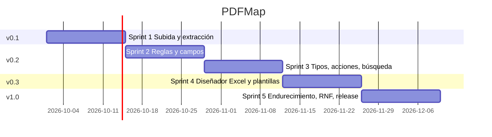

# Plan del proyecto

## Visión
Convertir cualquier reporte tabular PDF/TXT en Excel **sin programar**, configurando visualmente una plantilla reutilizable.

## Hitos (GitHub Milestones)

| Hito | Objetivo | Requisitos | Criterio de salida |
|---|---|---|---|
| **v0.1 — MVP extracción** | Cargar archivos pesados, extraer y visualizar, procesar en segundo plano | RF-01, RF-02, RF-03, RF-04, RF-05, RF-14 | Subida de 1 GB reanudable; extracción del PDF sintético de referencia (generate_fixtures.py) ≥ 40 pág/s |
| **v0.2 — Mapeo visual** | Reglas y campos gráficos con asistentes | RF-06, RF-07, RF-08, RF-09, RF-10 | Plantilla de ejemplo de ventas reproducible desde la UI; 0 descuadres en el reporte sintético |
| **v0.3 — Diseño Excel** | Columnas por arrastre, vista previa, plantillas, exportación | RF-11, RF-12, RF-13, RF-15, RF-16 | XLSX del reporte sintético igual al golden de regresión |
| **v1.0 — Release** | Resultados paginados, borrado, endurecimiento y RNF | RF-17, RF-18, RNF-01…RNF-09 | Plan de pruebas cerrado, informe resumen aprobado, imagen publicada |

## Calendario de sprints (2 semanas)



## Roles y responsabilidades (RACI resumida)

| Actividad | Product Owner | Dev Backend | Dev Frontend | QA | DevOps |
|---|---|---|---|---|---|
| Requisitos / SRS | A | C | C | C | I |
| Diseño / ADR | C | R | R | C | C |
| Implementación | I | R | R | C | I |
| Plan y casos de prueba | C | C | C | R/A | I |
| CI/CD y releases | I | C | C | C | R/A |
| Aceptación | R/A | I | I | C | I |

## Gestión de riesgos

Escala: Probabilidad (P) e Impacto (I) de 1 a 5; Exposición = P × I.

| ID | Riesgo | P | I | Exp. | Mitigación | Disparador |
|---|---|---|---|---|---|---|
| R-01 | PDFs escaneados sin capa de texto | 3 | 4 | 12 | Detección temprana y mensaje claro; OCR en el roadmap | `status=error` "sin texto" |
| R-02 | Fuentes proporcionales desalinean la cuadrícula | 3 | 3 | 9 | Calibración manual, campos por grupo regex, no se pierden caracteres | Campos con texto cortado |
| R-03 | Regex catastrófica (ReDoS) bloquea un hilo | 2 | 4 | 8 | Límite de longitud, búsqueda con límite, ejecución en hilos de trabajo | Trabajo sin progreso |
| R-04 | Fuga de datos reales en el repositorio | 2 | 5 | 10 | `.gitignore`, gitleaks en CI, datos sintéticos, revisión de PR | Alerta de gitleaks |
| R-05 | Memoria agotada con archivos > 1 GB | 2 | 4 | 8 | Streaming de extremo a extremo, pruebas de rendimiento | RSS > 1 GB |
| R-06 | Complejidad de UX del mapeador | 4 | 3 | 12 | Plantilla de ejemplo, asistentes, manual, pruebas de usabilidad | Usuarios no completan una plantilla en 15 min |
| R-07 | Concurrencia SQLite (bloqueos) | 2 | 3 | 6 | WAL, `busy_timeout`, escrituras por lotes | `database is locked` |
| R-08 | Dependencias con vulnerabilidades | 3 | 3 | 9 | Dependabot, pip-audit, npm audit, CodeQL | Alertas de seguridad |

```
Impacto →   1    2    3    4    5
P=4                  R-06
P=3                  R-02 R-01
                     R-08
P=2                  R-07 R-03 R-04
                          R-05
```
