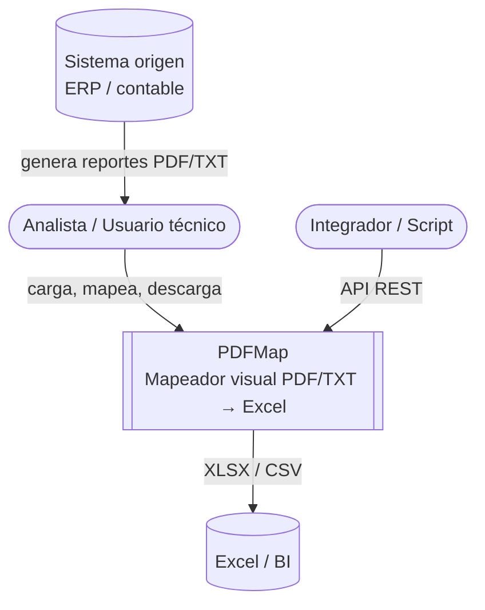
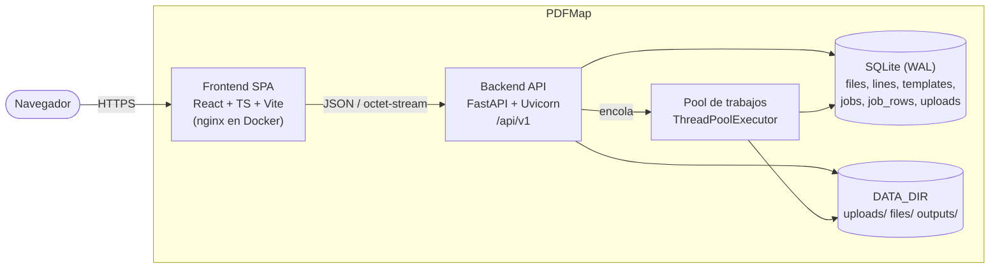
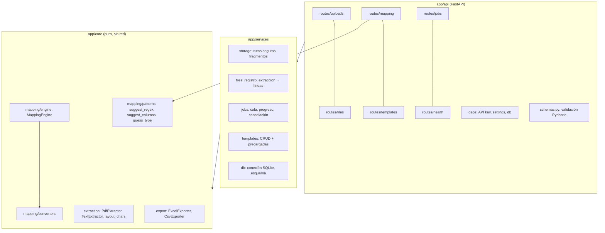
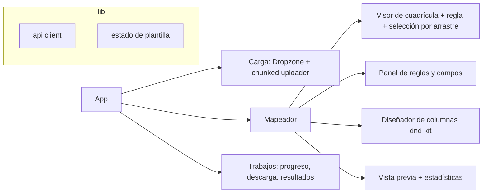
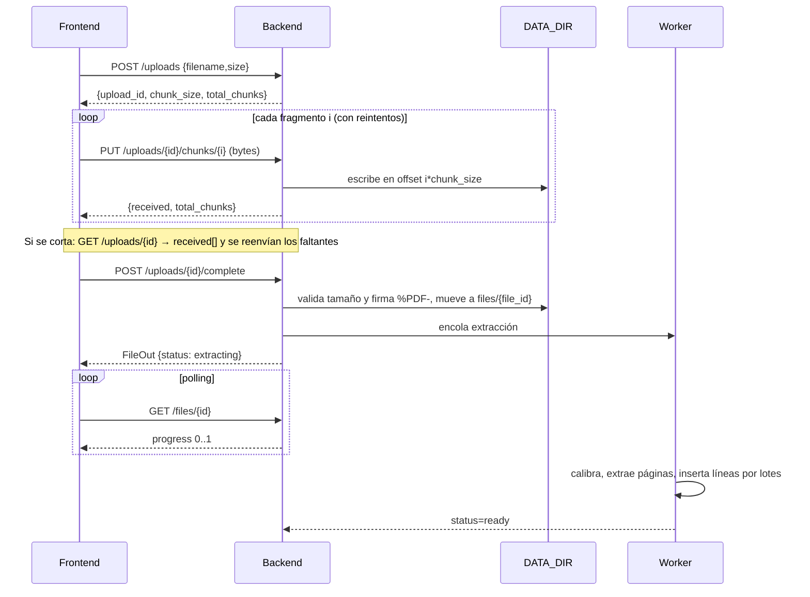
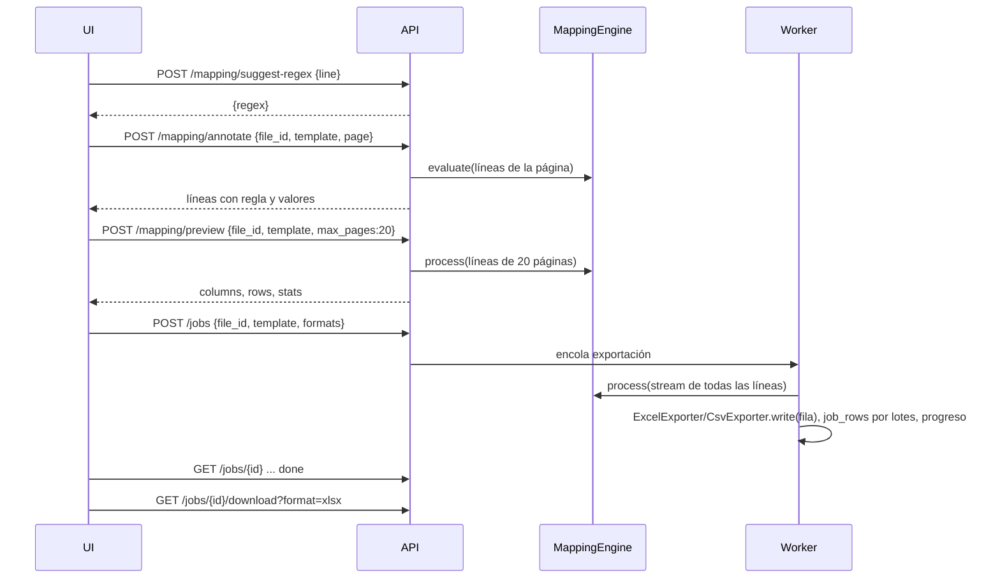

# Arquitectura de PDFMap

Documentada con el modelo **C4**. Contratos detallados: [API](../architecture/api-contract.md) · [Plantilla](../architecture/template-model.md).

## Nivel 1 — Contexto



## Nivel 2 — Contenedores



## Nivel 3 — Componentes del backend



Principio: `core` no conoce HTTP ni SQLite, por lo que es 100 % probable con pruebas unitarias y reutilizable desde una CLI.

## Componentes del frontend



## Secuencia — subida por fragmentos (RF-02)



## Secuencia — mapeo y procesamiento (RF-07…RF-16)



## Modelo de datos (SQLite)

```mermaid
erDiagram
  FILES ||--o{ LINES : contiene
  FILES ||--o{ JOBS : procesa
  TEMPLATES ||--o{ JOBS : usa
  JOBS ||--o{ JOB_ROWS : produce
  UPLOADS }o--|| FILES : "al completar crea"
  FILES { text id PK; text name; int size; text kind; text status; real progress; int pages; int lines; text error; text extraction_json; text sha256; text created_at }
  LINES { text file_id FK; int page; int n; text text }
  TEMPLATES { text id PK; text name; text data_json; int builtin; text created_at; text updated_at }
  JOBS { text id PK; text kind; text file_id FK; text template_id; text template_json; text status; real progress; text message; text stats_json; text formats; int rows; text created_at; text finished_at }
  JOB_ROWS { text job_id FK; int idx; text data_json }
  UPLOADS { text id PK; text filename; int size; int chunk_size; int total_chunks; text received_json; text created_at }
```
Índices: `lines(file_id, page, n)`, `job_rows(job_id, idx)`.

## Estructura de almacenamiento
```
DATA_DIR/
  pdfmap.db
  uploads/{upload_id}.part
  files/{file_id}/original.{pdf|txt}
  outputs/{job_id}/resultado.xlsx | resultado.csv
```

## Decisiones clave
Ver los [ADRs](adr/). En resumen: la **cuadrícula de texto genérica** (ADR-002) permite que todo el mapeo sea
declarativo; el **streaming** de extremo a extremo (ADR-004) mantiene la memoria constante; **SQLite + hilos**
(ADR-003) evita infraestructura adicional en un despliegue local con datos sensibles (RNF-09).

## Atributos de calidad → tácticas
| Atributo | Táctica |
|---|---|
| Rendimiento | Extracción una sola vez y caché de líneas en SQLite; lectura de texto completo de la página por llamada; inserción por lotes |
| Escalabilidad | Generadores en todo el pipeline; `write_only`; fragmentos con escritura por offset |
| Seguridad | UUID, rutas confinadas, validación Pydantic, API key, CORS, límites |
| Confiabilidad | WAL, estados persistentes, salidas atómicas, errores por línea no fatales |
| Mantenibilidad | Capas `api → services → core`, núcleo puro, contrato OpenAPI |
