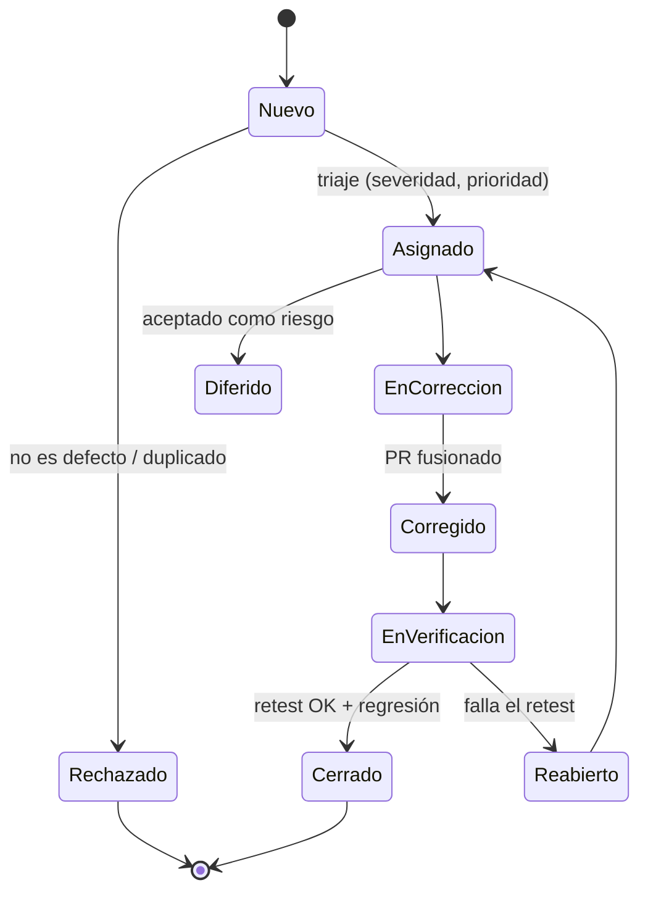

# Plantilla de reporte de defectos (IEEE 1044)

Los defectos se registran como issues de GitHub con la plantilla **Defecto (IEEE 1044)** (`.github/ISSUE_TEMPLATE/defect.yml`),
etiqueta `type/defect` e identificador `DEF-NNN` en el título.

## Campos (IEEE 1044-2009)

| Campo | Descripción | Ejemplo |
|---|---|---|
| ID | `DEF-NNN` | DEF-012 |
| Título | Resumen corto y específico | "to_number interpreta 1.234 como 1.234 con decimal=','" |
| Fecha / reportado por | | 2026-10-05 / QA |
| Estado | ver ciclo de vida | Nuevo |
| Requisito / caso | `RF-xx` / `TC-xxx` | RF-09 / TC-032 |
| Componente | backend-core, backend-api, frontend, ci, docs | backend-core |
| Versión / commit | build donde se detectó | v0.2.0 / `abc1234` |
| Entorno | SO, navegador, Python/Node | Windows 11, Chrome 140, Python 3.14 |
| Actividad de detección | revisión, unitaria, integración, E2E, exploratoria, producción | exploratoria |
| Severidad | impacto técnico (ver tabla) | Alta |
| Prioridad | urgencia de negocio (ver tabla) | P1 |
| Tipo (IEEE 1044) | datos, interfaz, lógica, cálculo, rendimiento, seguridad, usabilidad, documentación | cálculo |
| Modo | faltante, incorrecto, extra | incorrecto |
| Efecto | funcionalidad, rendimiento, seguridad, usabilidad, integridad de datos | integridad de datos |
| Repetibilidad | siempre / intermitente / una vez | siempre |
| Pasos para reproducir | numerados | 1… 2… 3… |
| Resultado esperado / obtenido | | 1234 / 1.234 |
| Evidencia | logs, capturas, plantilla JSON, **fixture sintético** (nunca datos reales) | `fixture.txt` |
| Causa raíz (al cerrar) | | separador de miles no eliminado |
| Corrección / PR | | #45 |
| Prueba de regresión | archivo de test añadido | `unit/test_converters.py::test_comma_decimal_thousands` |

## Severidad vs. prioridad

| Severidad | Definición en PDFMap |
|---|---|
| **Crítica** | Pérdida o corrupción silenciosa de datos en el Excel; caída del servicio; fuga de datos confidenciales |
| **Alta** | Flujo principal bloqueado (carga, mapeo o exportación) sin alternativa; cuadres erróneos |
| **Media** | Funcionalidad afectada con alternativa; errores visibles de conversión |
| **Baja** | Cosmético, textos, alineación visual |

| Prioridad | SLA de corrección |
|---|---|
| **P0** | Inmediata (hotfix) |
| **P1** | Dentro del sprint actual |
| **P2** | Próximo sprint |
| **P3** | Backlog |

Regla general: Crítica → P0/P1; un defecto de severidad baja puede tener prioridad alta si afecta a una demo o a un cliente.

## Ciclo de vida

Mapeo a etiquetas: `status/new`, `status/triaged`, `status/in-progress`, `status/fixed`, `status/verifying`, `status/deferred`; el cierre se hace al cerrar el issue.
