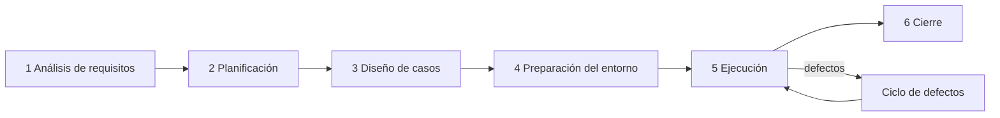

# STLC — Ciclo de vida de pruebas de software

El STLC se ejecuta **en cada iteración** del SDLC ([modelo-sdlc.md](../02-sdlc/modelo-sdlc.md)). Las fases 4 y 5 están
automatizadas en GitHub Actions; las demás quedan registradas en este directorio y en GitHub Issues.

## 1. Análisis de requisitos
| | |
|---|---|
| **Criterios de entrada** | SRS con requisitos identificados; criterios de aceptación disponibles |
| **Actividades** | Revisar la verificabilidad de cada RF/RNF; identificar tipos de prueba; detectar ambigüedades (issue `type/question`); análisis de riesgo |
| **Entregables** | Lista de requisitos verificables; borrador de la [RTM](matriz-trazabilidad-RTM.md); informe de viabilidad de automatización |
| **Criterios de salida** | 100 % de RF/RNF con al menos un criterio verificable; RTM inicial aprobada |

## 2. Planificación
| | |
|---|---|
| **Entrada** | Requisitos analizados; plan del proyecto |
| **Actividades** | Definir alcance, enfoque, herramientas, entornos, roles, calendario, riesgos y criterios de suspensión |
| **Entregables** | [Plan de pruebas IEEE 829](plan-de-pruebas-IEEE-829.md), [estrategia](estrategia-de-pruebas.md), estimación |
| **Salida** | Plan aprobado (PR revisado por el PO y QA) |

## 3. Diseño de casos de prueba
| | |
|---|---|
| **Entrada** | Plan aprobado; diseño/contrato API |
| **Actividades** | Diseñar casos con particiones de equivalencia, valores límite, tablas de decisión y transición de estados; preparar los datos sintéticos; escribir los scripts automatizados |
| **Entregables** | [casos-de-prueba.md](casos-de-prueba.md), fixtures (`backend/tests/fixtures/`), scripts de prueba, RTM actualizada |
| **Salida** | Cada requisito Must con ≥ 1 caso positivo y ≥ 1 negativo; casos revisados |

## 4. Preparación del entorno
| | |
|---|---|
| **Entrada** | Casos diseñados; requisitos de entorno |
| **Actividades** | Venv `.venv` + `requirements-dev.txt`; `npm ci`; navegadores de Playwright; `DATA_DIR` temporal por prueba (`tmp_path`); runners de GitHub Actions (ubuntu-latest, windows-latest) |
| **Entregables** | Entorno listo; **smoke test** (`pytest -m "unit" -x`, `GET /health`) verde |
| **Salida** | Smoke OK en local y CI |

## 5. Ejecución
| | |
|---|---|
| **Entrada** | Entorno listo; build integrado |
| **Actividades** | Ejecutar las suites en CI en cada PR; pruebas exploratorias ([checklist](checklist-pruebas-exploratorias.md)); registrar defectos ([plantilla](plantilla-reporte-defectos.md)); retest y regresión |
| **Entregables** | Reportes JUnit/HTML/cobertura (artefactos de CI), defectos en GitHub (`type/defect`), RTM con estado |
| **Salida** | 100 % de casos planificados ejecutados; 0 defectos críticos/altos abiertos; cobertura según RNF-06 |

### Criterios de suspensión y reanudación
- **Suspender** si el smoke falla, si > 30 % de casos están bloqueados o si un defecto crítico bloquea el flujo principal (carga → mapeo → exportación).
- **Reanudar** cuando el defecto bloqueante está corregido y el smoke vuelve a pasar.

## 6. Cierre
| | |
|---|---|
| **Entrada** | Ejecución finalizada; defectos triados |
| **Actividades** | Calcular [métricas](metricas-de-calidad.md); lecciones aprendidas; archivar artefactos; firmar la aceptación |
| **Entregables** | [Informe resumen de pruebas](informe-resumen-pruebas.md), métricas, RTM final |
| **Salida** | Informe aprobado; release etiquetado |

## Ciclo de vida del defecto
Ver [plantilla-reporte-defectos.md](plantilla-reporte-defectos.md#ciclo-de-vida).
