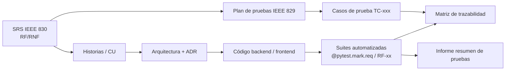

# Documentación de PDFMap

**PDFMap** es un mapeador visual y genérico que convierte reportes PDF/TXT de **formato desconocido** en libros de Excel.
El usuario arma la transformación de forma gráfica (seleccionando líneas, arrastrando sobre el texto y ordenando columnas)
y el backend la aplica en streaming sobre archivos de miles de páginas.

> ⚠️ **Confidencialidad**: los archivos reales de clientes (`*.Pdf`, `*.xlsx` en la raíz del proyecto) **nunca** se versionan.
> Todas las pruebas usan datos sintéticos (`backend/tests/fixtures/`).

## Mapa de documentos

| Carpeta | Fase SDLC | Contenido |
|---|---|---|
| [01-requisitos](01-requisitos/README.md) | Análisis | SRS IEEE 830, casos de uso, historias de usuario |
| [02-sdlc](02-sdlc/README.md) | Planificación / gestión | Modelo SDLC, plan del proyecto, gestión de configuración, DoR/DoD |
| [03-diseno](03-diseno/README.md) | Diseño | Arquitectura C4, secuencias, modelo de datos, ADRs |
| [architecture](architecture/) | Diseño (contratos) | [Contrato API REST](architecture/api-contract.md), [modelo de plantilla](architecture/template-model.md) |
| [04-testing](04-testing/README.md) | Pruebas (STLC) | STLC, estrategia, plan IEEE 829, casos, RTM, defectos, métricas, informes |
| [05-operacion](05-operacion/README.md) | Despliegue / mantenimiento | Despliegue, manual de usuario, runbook |

## Flujo documental

## Convenciones
- Cada requisito tiene un identificador estable (`RF-xx`, `RNF-xx`) que se usa en issues, ramas, PRs y tests.
- Los documentos se actualizan en el mismo PR que el código que los afecta (ver [Definición de Hecho](02-sdlc/definicion-de-hecho.md)).
- Diagramas en Mermaid para que GitHub los renderice.
